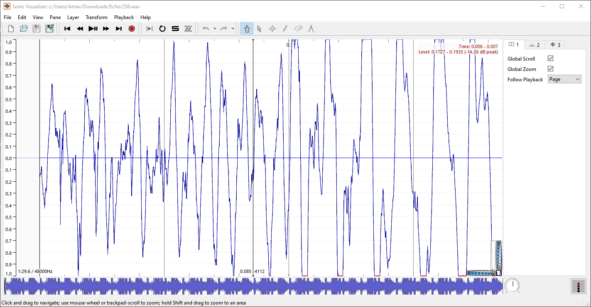

# echo
We are given a [wav file](256.wav). Where's the flag?

This challenge was a quite interesting introduction to cepstral analysis and really let me practice my signal processing knowledge. While I was really guessing at times, in the end, I ended up learning something new and pretty interesting!

This writeup assumes some basic knowledge of signal processing (signals/systems, fourier/z transforms, transfer functions, filtering, cross-correlation, sampling, etc.) and very basic knowledge of sound physics (interference, harmonics, etc.).

### echo echo echo
If you listen to the file, you'll notice that the audio quality is kind of bad and it seems like there is an echo. Let's first get some basic information about the music. According to [this](https://www.beatsperminuteonline.com/) the song is 150 bpm and it plays 8th notes, so every note is 0.2 seconds long.

Based on the challenge flavortext, I thought that there was something to do with an echo to solve this challenge. My first goal was to "remove" the echo. A clean song can be modeled as a signal $f(t)$. Then, an echo would be $g(t) = \alpha f(t-\Delta)$, where $\alpha$ is an attenuation factor and $\Delta$ is the time delay of the echo ([MathWorks, 2024](https://www.mathworks.com/help/signal/ug/echo-cancelation.html)). The song w/ echo is then $f'(t) = f(t) + g(t)$. 

I first opened the file in Sonic Visualizer and checked if I could find an obvious echo (which would help me find $\alpha$ and $\Delta$). Unfortunately nothing was super obvious here. So I would probably have to do some signal processing to find this echo. I did some research on techniques to find this echo and how to filter it out, and I found some sources.



## finding the echo
In theory, I should be able to calculate the autocorrelation/autocovariance between a signal and a delayed version of itself to find the delay of the echo ([MathWorks, 2024](https://www.mathworks.com/help/signal/ug/echo-cancelation.html), [Augusto, 2018](https://www.quora.com/How-do-I-detect-echoes-in-an-audio-signal)). This process basically superimposes two signals on top of each other and determines how "similar" they are. I found some algorithms for autocorrelation and implemented them, looking for a peak in the autocorrelation.

Here's some the code I wrote to do this ([matt, 2018](https://stackoverflow.com/questions/20110590/how-to-calculate-auto-covariance-in-python)). I was only concerned with the echo for the first note (0.2s) of the song, as I noticed that calculating autocorrelation takes a really long time.

```py
import scipy.io.wavfile as wv
import matplotlib.pyplot as plt
import numpy as np
from scipy.signal import butter, lfilter
from tqdm import tqdm

time = np.arange(0,len(signal)/rate,1/rate)
halfsec = int(sec_to_samples(0.5))

def lagged_auto_cov(Xi,t):
    """
    for series of values x_i, length N, compute empirical auto-cov with lag t
    defined: 1/(N-1) * \sum_{i=0}^{N-t} ( x_i - x_s ) * ( x_{i+t} - x_s )
    """
    N = len(Xi)

    # use sample mean estimate from whole series
    Xs = np.mean(Xi)

    # construct copies of series shifted relative to each other, 
    # with mean subtracted from values
    end_padded_series = np.zeros(N+t)
    end_padded_series[:N] = Xi - Xs
    start_padded_series = np.zeros(N+t)
    start_padded_series[t:] = Xi - Xs

    auto_cov = 1./(N-t) * np.sum( start_padded_series*end_padded_series )
    return auto_cov

normalized = y / y[0]
plt.plot(x,normalized)
```


The first large nonzero peak in the graph is around 650 samples which corresponds to a frequency of 74Hz (this is close to a D2 note - not very exact but that's ok). There are also a lot of multiples of this frequencies that show up as peaks, which is further evidence that these frequencies are just for notes played in the song. That's cool, but it's not what I'm looking for.

There is also a somewhat prominent negative peak at 440 samples or 9.17ms. The frequency is 109 Hz, which could be an A2, but it didn't seem like there were many multiples of this frequency also showing up as peaks. This led me to think that this peak was the echo (spoiler: it wasn't), so I thought the echo delay was 9.17ms.

## removing the echo
Suppose that $f'(t) = f(t) + \alpha f(t-\Delta)$, so $f'(t)$ is the version of $f(t)$ with an echo. If we know values for $\alpha$ and $\Delta$, it is not difficult to recover $f$ using a filter. Consider the discrete transfer function $H(z)$

$$ \begin{align*} H(z) &= \frac{F'(z)}{F(z)}  \\
    &= \frac{\left(1 + \alpha z^{-\Delta}\right) F(z)}{F(z)} &&\text{Properties of z-transform} \\
    &= 1 + \alpha z^{-\Delta}
\end{align*}
$$

Note that we want to go from $f'$ to $f$ so we must invert $H$:

$H^{-1}(z) = \frac{1}{1 + \alpha z^{-\Delta}}$

To apply a filter with this transfer function using [lfilter](https://docs.scipy.org/doc/scipy/reference/generated/scipy.signal.lfilter.html), we set the numerator and denominators as such ([MathWorks, 2024](https://www.mathworks.com/help/signal/ug/echo-cancelation.html)). Note that I didn't actually know the value of $\alpha$, but I figured that a guess of 0.5 was good enough.

```py
from scipy.signal import lfilter
idx = 440
test_alpha = 0.5
new_song = lfilter([1],[1] + [0] * (idx - 2) + [test_alpha],signal)
```

Then, we normalize and write our signal to a new wav file. This one shouldn't have an echo!

```py
new_song = (new_song / max(new_song) * 32767).astype(np.int16)
plt.plot(time[:halfsec],new_song[:halfsec])
new_song = new_song.astype(np.int16)
wv.write('recovered.wav',rate,new_song)
```

### echo is gone
Ok, now what? We removed the echo in this new [file](recovered.wav), is that it? Where's the flag? Also, it's not like we really removed the echo that well, you can still kind of hear it. If anything, we made the song more quiet. At this point, I didn't think I was on the right track and I was getting a little confused. 

At around 2am, I'm a bit desperate and I run `strings` on the original file, and I see this at the bottom: `cepstral domain single echo`

Oh, that seems like a massive hint!

## Cepstral Analysis
A cepstrum is like a fourier transform^2. Basically, you take the (inverse) fourier transform of a log-scaled fourier transform. The real-valued cepstrum, which is what we are concerned about, is: $C_r = \mathcal{F}^{-1} \{ \log | \mathcal{F} \{ f(t) \} | \}$ ([Wikipedia, 2024](https://en.wikipedia.org/wiki/Cepstrum)).

Why is this useful? Consider an instrument that is playing a note at 100Hz. You may have learned in physics class that this is a "fundamental frequency" of the instrument and there are many "harmonics" -- frequencies that are also played that are multiples of 100Hz. If we take a fourier transform of the sound from the instrument, we may see peaks at 100Hz, 200Hz, etc. In a noisy environment, however, these peaks may become obscured by other sources and we may not be able to determine that 100Hz is a *fundamental* frequency present in the environment. Therefore, we take a logarithm again to make differences in the amplitude of the spectrum more prominent. We then take another (inverse) fourier transform which reveals "periodic structures" in the spectrum ([Wikipedia, 2024](https://en.wikipedia.org/wiki/Cepstrum#Power_cepstrum)). In our case, this structure is the 100Hz/200Hz/300Hz harmonics. Therefore, our cepstrum will have a peak at 0.01 s (the units of the x-axis change to time again because it's an inverse Fourier Transform). This peak tells us that the frequency 1/0.01s = 100Hz is a fundamental frequency ([Frolian, 2019](http://flothesof.github.io/cepstrum-pitch-tracking.html)).

Side note: mathematicians are really bad at naming things. A signal has a time domain, a spectrum has a frequency domain, and a cepstrum has a *quefrency* domain. 🤦. The units of this domain are time (seconds or samples), but it's really better to think of it like an inverse frequency (48 samples in the quefrency domain is really a frequency of 1/48 = 1000 Hz).

So how is this useful to the challenge? Well consider what an echo is again: $f'(t) = f(t) + \alpha f(t - \Delta)$. If $f$ is composed of sinusoids, adding it with a time-delayed version of itself will cause interference for each sinusoid. Consider one component sinusoid for $f$: $a\sin(\omega t)$. Also consider its time delayed version $a\sin(\omega(t-\Delta))$. If $\omega(t-\Delta)$ is a multiple of $2\pi$, these two sinusoids will constructively interfere. If $\omega(t-\Delta)$ is an odd multiple of $\pi$, these two sinusoids will destructively interfere. And there is a whole other range of possibilities in the middle. The effect of this is that multiples of the frequency $\omega = 2\pi / \Delta$ constructively interfere, and in the Fourier spectrum, they have somewhat larger peaks. This is a periodic structure in the spectrum, and a perfect place to apply the cepstrum! If we do so, we should (theoretically) see a peak at a quefrency of $1/\Delta$, which tells us what the delay of the echo is ([Libery Instruments](http://www.libinst.com/cepst.htm))!

### Encoding Information
Just one problem, I've been here before. How do you actually solve the challenge / find information? I mean I think I found a more foolproof way to find the echo, but how does that help me find the flag? I went searching on the internet, and I found pretty much exactly what I needed: an encoding scheme using audio echoes ([Bender, Gruhl, et. al, 1996](http://dx.doi.org/10.1147/sj.353.0313), [England](https://www.ee.columbia.edu/~ywang/MSS/Project/Jeff_England_Audio_Steganography.ppt)).  

The way to encode a message using echoes is as follows: choose two somewhat different but small echo delays (the difference should be imperceptible to the naked ear). Use them to encode binary information during each "time window" of the audio file. If one delay is chosen during a window, a '0' is encoded, and if the other is chosen, a '1' is encoded.

According to the paper, the actual peak corresponding to the echo delay in the cepstrum is very small, and the cepstrum may contain other peaks at multiples of the echo delay. The latter effect is might not be intentional (I think), but it does allow us to calculate the autocorrelation between the cepstrum and a delayed version of itself. This should have a more prominent peak at the echo delay (as well as a very large peak at 0).

Also, we needed better a better autocorrelation algorithm because the one that I found on Stack Overflow sucked and was too slow. Autocorrelation is just a special instance of cross-correlation, so you can use FFT to speed it up. [This library](https://www.statsmodels.org/stable/generated/statsmodels.tsa.stattools.acf.html) offers a good function for this.

We looked for peaks in the cepstrum autocorrelation in certain windows of the song. These peaks could either be around 48 or 57 samples depending on the start of the window and window length that we chose. The following images show a cepstrum autocorrelation peak at 48 samples and a peak at 57 samples during 2 different windows.


## Solving
The last thing we had to do is determine the appropriate window length that let us determine the flag. We divided the song into sections equal to the window length, determined if the cepstrum autocorrelation peak was closer to 48 or 57 (which told us which one of the two echo delays was used during the window), and converted that information into binary. 48 ended up being '0' and 57 ended up being '1'. 

This last part was a bit annoying, since we were just guessing window lengths. It turned out that the correct window length was around 16800 samples, or 1/256th of the song (the flag is 256 bits long). That might also be why the audio file was called `256.wav` lol.

## Solve

```py
import scipy.io.wavfile as wv
import matplotlib.pyplot as plt
import numpy as np
from scipy.signal import butter, lfilter
from tqdm import tqdm
from acoustics.cepstrum import real_cepstrum
import statsmodels.api as sm

rate, signal = wv.read('256.wav')

def getmax(start,window, plot = False):
    cepstrum = real_cepstrum(signal[start:start+window])
    foo = sm.tsa.acf(cepstrum, nlags=100)
    if plot:
        plt.plot(foo)
        plt.xlim(40,80)
        plt.ylim(0,.1)
    max_idx = np.argmax(foo[40:80]) + 40
    return max_idx

maxs = []
sample_window = 16800
total_samples = len(signal)
current_time = 0
while current_time <= total_samples - sample_window:
    maxs.append(getmax(current_time,sample_window))
    current_time += sample_window
print(maxs)

binary = ''
for i in maxs:
    if i < 50:
        binary += '0'
    else:
        binary += '1'
print(binary)
check = [binary[i:i+8] for i in range(0,len(binary),8)]
chars = [chr(int(i,2)) for i in check]
print(''.join(chars))
```

## Flag: csawctf{1nv3st_1n_s0undpr00f1ng}
