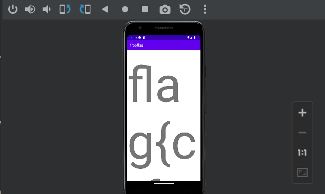
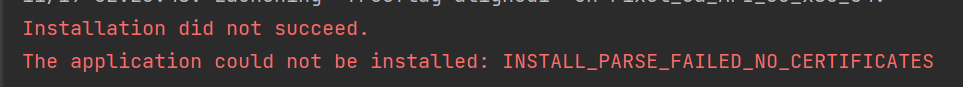

# its right there

We are given a .apk file, which is for Android applications. To analyze this file, I downloaded Android Studio and used the `profile or debug apk` option. With the Android emulator, the phone screen gave this output:
 <br>
Interesting. The flag is probably fully displayed in the textbox, but the font size is too big. Is there a way to retrieve the flag from the apk or change the window size?
Running `strings freeflag.apk | grep flag` on the apk, we get:
```
freeflag
flag
Theme.Freeflag
```
Not super helpful. <br>
Going back to Android studio, we can see a bunch of `.smali` files. One of them in particular, `com.squarectf/freeflag/MainActivity.smali` has the disassembled Main method for the app (everything else appears to be a helper method not created by squarectf). <br>
Wait, what is a smali file? A quick Google search tells us that they are decompiled .dex (Dalvik executable) files, which are Android executables. So we are looking at some kind of assembly. A bit more Googling leads us to find this [list of opcodes](http://pallergabor.uw.hu/androidblog/dalvik_opcodes.html). So, we can start analyzing the smali. <br>
Scrolling through the smali file, we see `"AES/ECB/PKCS5Padding"`, `javax/crypto/Cipher`, `java/util/Random`, etc. This means that the flag is probably encrypted and we likely cannot retrieve the flag directly from the dissassembly. So, we have to find a way to resize the window or the font to see the whole flag. Looking back at the beginning, we find:
```smali
    invoke-virtual {v1, v0}, Landroid/view/Display;->getMetrics(Landroid/util/DisplayMetrics;)V

    iget v1, v0, Landroid/util/DisplayMetrics;->heightPixels:I

    iget v0, v0, Landroid/util/DisplayMetrics;->widthPixels:I

    invoke-static {v1, v0}, Ljava/lang/Integer;->max(II)I

    move-result v0

    div-int/lit8 v0, v0, 0x3

    int-to-float v0, v0

    const/4 v1, 0x0

    invoke-virtual {p1, v1, v0}, Landroid/widget/TextView;->setTextSize(IF)V
```
The last line sets the font text size, maybe we can edit this! Using the list of opcodes, we can figure out what this snippet does. Lines 2 and 3 store the screen height and width into the v1 and v0 registers, respectively. Then, we find the max value of these 2 sizes, and store it in the v0 register. We then divide v0 by 3, convert it to a float. We store a new 4-bit constant of 0 into v1. We then call the setTextSize method with parameters p1, v1, and v0. p1 is the "this" or "self" parameter, v1 is the unit size, and v0 is the font size. So essentially, our font size is too big. We can make it smaller by changing 0x3 to a smaller value! Now, we just have to edit the smali file. <br>
We can use the apktool program to decompile, edit and rebuild the apk file. The apktool version from `apt` is dirty and doesn't work well, so we will install from [source](https://ibotpeaches.github.io/Apktool/install/). <br>
Disassemble the apk with `apktool d freeflag.apk`. This creates a freeflag directory. Edit the `freeflag/smali/com/squarectf/freeflag/MainActivity.smali` file as described above. I changed 0x3 to 0x24. In your original directory, rebuild the apk with `apktool b freeflag`. The new apk will be in `freeflag/dist/freeflag.apk`. <br>
In order to run Android applications, we must sign and align them. Through a very painful process, here's what I did. 
- Create a new key with `sudo keytool -alias sign -genkey -v -keystore my-release-key.keystore -keyalg RSA -keysize 2048 -validity 1000`
- Sign the apk with `sudo jarsigner -verbose -sigalg SHA1withRSA -keystore my-release-key.keystore freeflag/dist/freeflag.apk sign`
  - You need to install Java JDK 11 headless to run jarsigner. `sudo apt-get install openjdk-11-jdk-headless`
- Align the apk with `zipalign -v 4 freeflag/dist/freeflag.apk freeflag/dist/freeflag-aligned.apk`
  - [Can't run zipalign?](https://stackoverflow.com/questions/31048208/zipalign-command-not-found) My binary was in `~/Android/Sdk/build-tools/33.0.0/zipalign` <br>

Now, we can try to run `freeflag/dist/freeflag-aligned.apk` in Android studio.
 <br>
Wait what? No certificates? (Insert megamind face). I thought we already signed it? Turns out that we needed to sign it twice, because [Android Studio is great](https://stackoverflow.com/questions/2914105/what-is-install-parse-failed-no-certificates-error). <br>
Thankfully, the application still works on an actual Android phone. Thanks Alex! <br>


## Flag: `flag{ctfs_just_give_you_flags_these_days_its_ridicul0us}`
